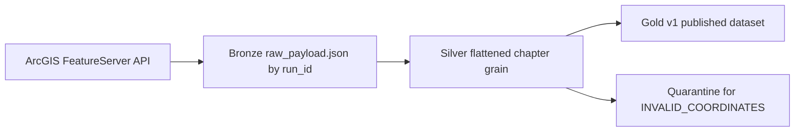

# Architecture Note

## Overview

This solution implements a thin Azure-style medallion pipeline for a public ArcGIS FeatureServer source.

- **Bronze** stores raw API payload by `ingest_run_id`
- **Silver** flattens API features to chapter grain, types fields, deduplicates by `chapter_id`, and applies DQ rules
- **Gold** publishes a stable consumer-facing `v1` dataset containing only clean and warned rows
- **Quarantine** stores only DQ-Q1 failures for debugging and auditability

## Design choices

- Local filesystem layout mimics ADLS-style lake zones for reproducibility
- Python is used for API ingestion because the source is a REST endpoint
- PySpark is used for Silver/Gold to align with the assignment's Azure + Spark expectation
- Gold is overwritten each run for simplicity and deterministic review

## Data flow

## DQ implementation

- **DQ-Q1**: invalid coordinates are quarantined and excluded from Silver/Gold
- **DQ-W1**: missing / blank / UNKNOWN city is published with warning metadata
- Run metrics logged: `rows_in`, `rows_quarantined`, `rows_warned`, `rows_ok`

## Production additions

In production I would add Delta Lake, MERGE-based idempotency, schema evolution controls, orchestrated scheduling, and monitoring / alerting integrations.
